# Structuring UI Code around authentication

To redirect unauthenticated users to the login page in case an API call results in an Unauthorized (401) response,  I would suggest the following:

- Using the Context API to create an Authentication Context containing a boolean state parameter that corresponds to whether the user is authenticated or not - isAuthenticated - giving the views that need to be blocked access to it.
  
- Creating a "private route" wrapper component to wrap around the paths created by react-router that need authentication. The wrapper would require isAuthenticated to be true for the view to be rendered and redirect to the login page in case it isn't.

- If an API call returns a 401 response, isAuthenticated will be set to false, and the app will redirect the user.

